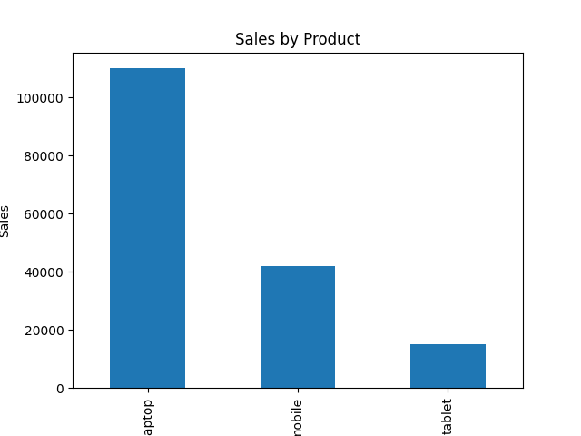
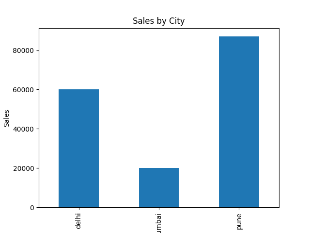

# Sales Analysis Project

This project analyzes sales data using Python.

Tools Used:
- Python
- Pandas
- Matplotlib

Analysis:
- Total Sales
- Sales by Product
- Sales by City
- Top Selling Product
- City with Highest Sales

Visualizations

Product Sales

City Sales

